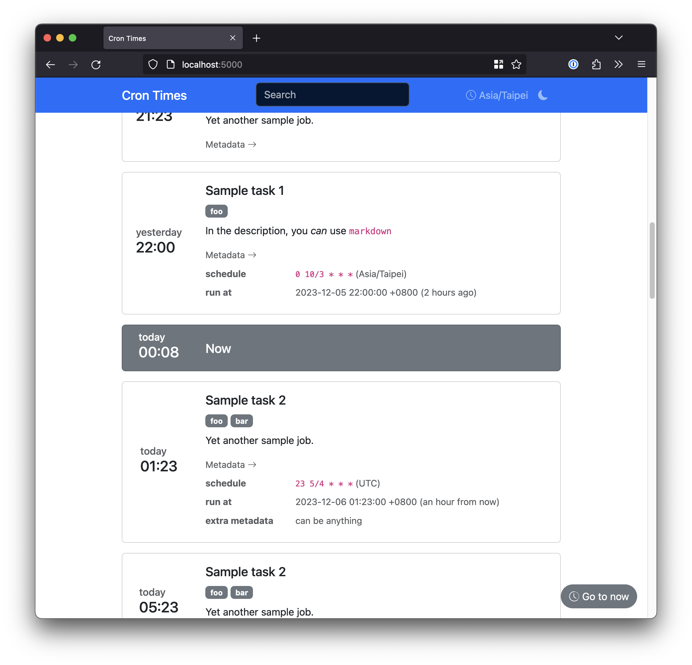

# Timetable for cronjobs

[](https://pypi.org/project/cron-times/)

Show schdueled jobs in a more readable way.



*features*

* Easy configure - Setup job list in YAML format
* Timezone supported - Able to configure server timezone and show the time in local time
* Quick filtering - Allow customized label and quick lookup


## Usage

1. Install

   ```bash
   # basic
   pip install cron-times

   # with extra features
   pip install 'cron-times[cli]'
   ```

2. Create task definition files

   Task definition are YAML files placed under `tasks/` folder in current working directory.

   An example task:

   ```yaml
   - name: task name
     schedule: "0 10 * * *"
     timezone: Asia/Taipei  # tzdata format; Would use UTC if not provided
     description: In the description, you *can* use `markdown`
     labels:
       - sample-label
       - another-label
   ```

   All `*.yaml` files would be loaded on initialization time.
   We could use scripts to pull the defines from other places before flask started.

3. Run the app for testing

   ```bash
   flask --app cron_times run
   ```

### Built-in providers

This tool comes with few builtin providers. The providers read cronjobs from the following places and build into task definition file:

* `crontab`: Read crontab on local machine
* `dbt`: Query scheduled jobs from [dbt cloud](https://www.getdbt.com/product/what-is-dbt/). API triggered and manually triggered jobs are discarded.

To use the provider, you MUST install `cron-times` with `[cli]` option.

```bash
cron-times get-tasks <source> --help
```

We could run these providers before starting the app to refresh the definition files.

### Deploy

[Flask suggests to use a WSGI server for production](https://flask.palletsprojects.com/en/2.2.x/deploying/).
You can run the WSGI server app and call the module `cron_times:app` for such usage.

Take [gunicorn](https://gunicorn.org/) as an example:

```bash
gunicorn --bind 0.0.0.0:8000 --workers 2 cron_times:app
```

> **Note**
>
> This app does not reload task definition after it started.
> You should restart the app in case task definition is changed.
